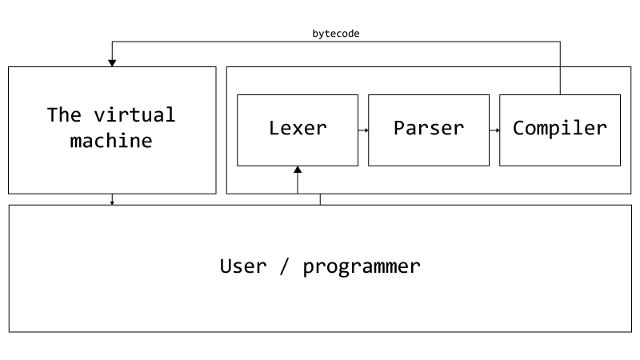

# BIVMBPL - A What?

Programming languages. Software developers, hackers and nerds use them every day, but how do they work and can you build your own? I've been intrigued by the idea of designing & building my own programming languages, and over the past few years I've read a bunch of blogs, manuals, and tutorials about this very subject. In this series you can read through my journey of developing yet another programming language (yes, I've made quite a few programming languages at this point, though most of them are not very good). As a quick disclaimer before we begin, there are many ways to do this, and as I'm a self taught programmer, there're also probably better ways. In my opinion this doesn't mean that such a project can't be a valuable lesson, since programming is largely problem solving, not just knowing syntax and 'how to code'.
I hope that using this guide you'll be able to create something working and experience the thrill of making your own programming language! This series will describe the making of a *bytecode interpreted virtual machine based programming language*. 

## Components overview

Let's start with the basics. The first question we need to ask is, of which parts does this "programming language" consist which makes it a *working* programming language? So there are a few different components, which are: 

- The lexer-parser-compiler (could also be viewed as three separate components)
- The virtual machine interpreter
- All other "components" will be assigned to one of the categories above.

The *lexer-parser-compiler* component takes a string input of code and then generates a form bytecode. This bytecode, which we'll define ourselves, will then be passed on to the *virtual machine interpreter* (*vm*) component. This'll go through the bytecode(s), basically in a large `switch` statement (ambiguous with an `if`, `else if` & `else`). In this `switch`, the *vm* will handle all sorts of actions, like performing calculations and storing variables. It's called a *virtual machine* because it has an operator stack. This will be explained in detail later on.

## Note

This programming language runs on a bytecode interpreter, in de form of a virtual machine. To make the language simple and more intuitive, the interpreter handles object & type casting, meaning that the language itself is dynamically typed. Other style aspects of our language will be explained later.

I'll be using C#, simply because I feel most comfortable with it, but feel free to use any other language (though it helps if the language of your choice is object oriented). This also won't be a guide from which you can copy the code snippets to create a working program, but rather a theoretical approach which provides you with scaffolding to start on your own. This doesn't mean there'll be no code or examples, just that this is not the main focus of this series.
